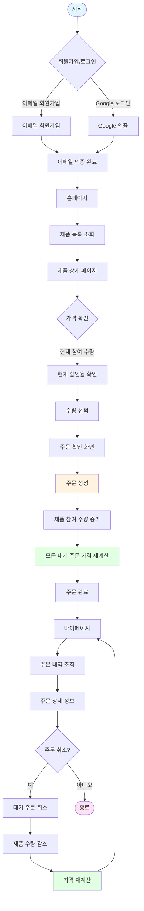
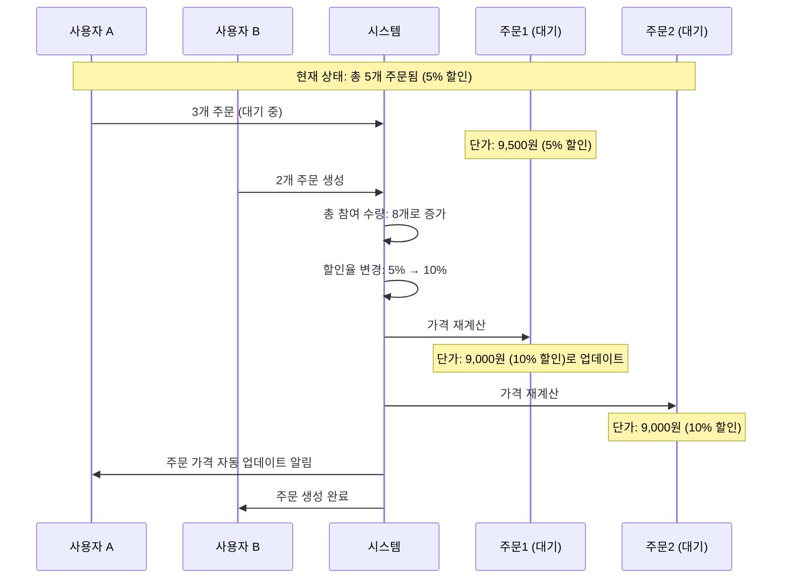
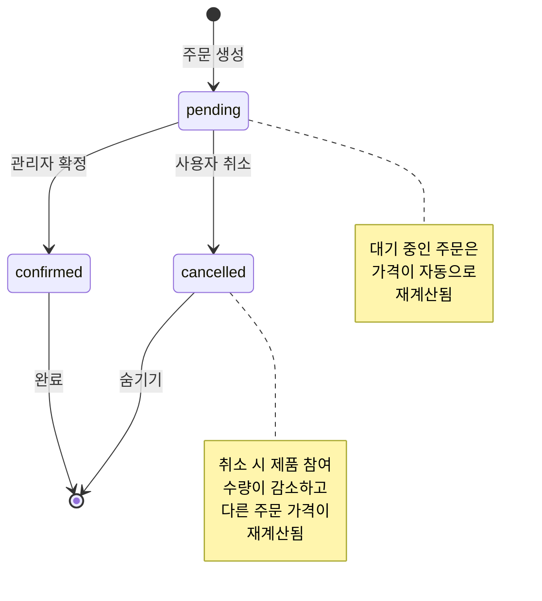

# 피쉬허브 공동구매 플랫폼

**더 많은 사람이 함께 구매할수록 더 저렴한 가격으로 제품을 구매할 수 있는 온라인 공동구매 플랫폼**

---

## 📋 프로젝트 개요

피쉬허브 공동구매 플랫폼은 참여 인원이 증가할수록 할인이 커지는 구간별 할인 정책을 기반으로 한 실시간 공동구매 시스템입니다. 사용자들이 함께 모여 더 저렴한 가격으로 원하는 제품을 구매할 수 있도록 돕는 것이 핵심 가치입니다.

### 핵심 가치 제안
- **집단 구매의 힘**: 인원이 많아질수록 더 큰 할인
- **실시간 가격 업데이트**: 참여 인원 변화에 따른 즉시 할인율 반영
- **자동 가격 재계산**: 새로운 주문 발생 시 모든 대기 중인 주문의 가격 자동 업데이트

---

## 🔄 전체 프로세스 흐름



---

## ✨ 주요 기능

### 기능별 역할 구분

| 역할 | 주요 기능 | 설명 |
|------|----------|------|
| **일반 사용자** | 회원가입/로그인 | Google 소셜 로그인 또는 이메일 회원가입 |
| | 제품 조회 | 제품 목록 및 상세 정보 확인, 이미지 갤러리 |
| | 공동구매 참여 | 수량 선택 후 주문 생성 |
| | 주문 관리 | 주문 내역 조회, 취소, 상세 확인 |
| | 배송지 관리 | 배송지 등록 및 수정 |
| **관리자** | 제품 관리 | 제품 등록/수정/삭제, 할인 구간 설정 |
| | 사용자 관리 | 사용자 목록 조회, 차단/해제 |
| | 주문 모니터링 | 전체 주문 현황 확인 |
| | 템플릿 관리 | 상품정보 제공고시 템플릿 관리 |
| | 사이트 설정 | 사이트명, 로고 변경 |

### 사용자 기능 상세

| 기능 카테고리 | 세부 기능 | 설명 |
|--------------|----------|------|
| **회원 관리** | Google 로그인 | 소셜 로그인으로 빠른 가입 |
| | 이메일 회원가입 | 이메일/비밀번호로 회원가입 |
| | 회원정보 변경 | 이름, 전화번호, 비밀번호 수정 |
| | 배송지 등록 | 배송 주소 등록 및 관리 |
| **제품 관련** | 제품 목록 | 활성 제품 목록 조회 |
| | 제품 상세 | 제품 정보, 이미지, 할인 구간 확인 |
| | 실시간 가격 | 현재 참여 수량 기준 할인율 표시 |
| | 주문하기 | 원하는 수량 선택 후 주문 생성 |
| **주문 관련** | 주문 내역 | 내가 주문한 모든 주문 조회 |
| | 주문 상세 | 주문 상세 정보 및 가격 내역 확인 |
| | 주문 취소 | 대기 중인 주문 취소 가능 |
| | 주문 숨기기 | 취소된 주문 목록에서 숨기기 |

### 관리자 기능 상세

| 기능 카테고리 | 세부 기능 | 설명 |
|--------------|----------|------|
| **대시보드** | 통계 현황 | 전체 사용자/제품/주문 수 확인 |
| | 최근 활동 | 최근 등록된 제품/사용자/주문 모니터링 |
| **제품 관리** | 제품 등록 | 새 제품 등록 및 이미지 업로드 |
| | 제품 수정 | 제품 정보 및 할인 구간 수정 |
| | 제품 삭제 | 제품 삭제 및 상태 관리 |
| | 템플릿 연동 | 상품정보 제공고시 템플릿 연결 |
| **사용자 관리** | 사용자 목록 | 전체 사용자 조회 |
| | 사용자 차단 | 사용자 기간/영구 차단 |
| | 차단 해제 | 차단된 사용자 해제 |

---

## 💰 구간별 할인 시스템

### 할인 구간 설정 예시

| 참여 수량 구간 | 할인율 | 할인 금액<br/>(기본가 10,000원 기준) | 최종 가격 |
|--------------|--------|-----------------------------------|----------|
| 1 ~ 5개 | 5% | -500원 | 9,500원 |
| 6 ~ 10개 | 10% | -1,000원 | 9,000원 |
| 11 ~ 20개 | 15% | -1,500원 | 8,500원 |
| 21 ~ 50개 | 20% | -2,000원 | 8,000원 |
| 51개 이상 | 25% | -2,500원 | 7,500원 |

### 할인 계산 방식

1. **현재 총 참여 수량 확인**: 제품에 현재까지 주문된 총 수량
2. **할인 구간 매칭**: 현재 수량이 속하는 할인 구간 찾기
3. **할인율 적용**: 해당 구간의 할인율로 최종 가격 계산
4. **자동 재계산**: 새로운 주문 발생 시 모든 대기 중 주문의 가격 자동 업데이트

### 가격 재계산 프로세스



---

## 📊 주문 상태 흐름

### 주문 상태별 정의

| 상태 | 설명 | 가능한 작업 | 색상 표시 |
|------|------|------------|----------|
| **pending** | 대기 중 | 주문 취소 가능 | 노란색 (warning) |
| **confirmed** | 확정됨 | 조회만 가능 | 초록색 (success) |
| **cancelled** | 취소됨 | 숨기기 가능 | 빨간색 (danger) |

### 주문 상태 전이 다이어그램



---

## 🎯 핵심 비즈니스 로직

### 1. 구간별 할인 계산

할인 구간은 제품 등록 시 관리자가 설정하며, 현재 총 참여 수량에 따라 자동으로 할인율이 적용됩니다.

**계산 공식**
```
할인 금액 = 기본 가격 × 할인율
최종 가격 = 기본 가격 - 할인 금액
```

**예시 시나리오**

| 시점 | 총 참여 수량 | 할인 구간 | 할인율 | 단가 (기본가 10,000원) |
|------|------------|----------|--------|---------------------|
| 초기 | 0개 | - | 0% | 10,000원 |
| 주문 1 | 3개 | 1~5개 | 5% | 9,500원 |
| 주문 2 | 5개 | 1~5개 | 5% | 9,500원 |
| 주문 3 | 8개 | 6~10개 | 10% | 9,000원 ← 자동 재계산 |
| 주문 4 | 12개 | 11~20개 | 15% | 8,500원 ← 자동 재계산 |

### 2. 실시간 가격 재계산

새로운 주문이 발생할 때마다 해당 제품의 모든 대기 중인 주문의 가격이 자동으로 재계산됩니다.

**재계산 트리거**
- 새로운 주문 생성 시
- 기존 주문 취소 시

**재계산 대상**
- 상태가 `pending`인 모든 주문

**재계산 결과**
- 모든 대기 주문의 `finalPrice` (단가) 업데이트
- 모든 대기 주문의 `totalPrice` (총 가격) 업데이트
- 사용자에게 변경된 가격 표시

---

## 📈 주요 사용 시나리오

### 시나리오 1: 일반 사용자의 주문 프로세스

| 단계 | 사용자 행동 | 시스템 처리 | 결과 |
|------|-----------|-----------|------|
| 1 | 로그인 | 인증 확인 | 홈페이지 접근 |
| 2 | 제품 목록 조회 | 제품 목록 표시 | 제품 카드 표시 |
| 3 | 제품 선택 | 제품 상세 정보 로드 | 제품 상세 페이지 표시 |
| 4 | 가격 확인 | 현재 할인율 계산 | 실시간 가격 표시 |
| 5 | 수량 선택 | 선택한 수량으로 총액 계산 | 예상 주문 금액 표시 |
| 6 | 주문 확인 | 주문 생성 및 수량 증가 | 주문 완료 |
| 7 | 가격 재계산 | 모든 대기 주문 가격 업데이트 | 최신 할인율 적용 |

### 시나리오 2: 관리자의 제품 등록 프로세스

| 단계 | 관리자 행동 | 시스템 처리 | 결과 |
|------|-----------|-----------|------|
| 1 | 제품 등록 페이지 접근 | 권한 확인 | 제품 등록 폼 표시 |
| 2 | 제품 정보 입력 | 입력값 검증 | 제품 기본 정보 저장 준비 |
| 3 | 할인 구간 설정 | 구간별 할인율 입력 | 할인 정책 설정 |
| 4 | 이미지 업로드 | 이미지 저장 | 이미지 URL 생성 |
| 5 | 템플릿 선택 | 상품정보 제공고시 템플릿 연결 | 정보 항목 자동 생성 |
| 6 | 제품 등록 완료 | 제품 데이터 저장 | 제품 활성화 |

---

## 🎨 사용자 경험 특징

### 주요 UI/UX 요소

| 요소 | 설명 | 효과 |
|------|------|------|
| **하단 탭 네비게이션** | 모바일 앱 스타일 네비게이션 | 빠른 페이지 이동 |
| **카드 형식 주문 내역** | 각 주문을 카드로 표시 | 가독성 향상 |
| **실시간 가격 표시** | 참여 수량 변화 즉시 반영 | 투명한 가격 정보 |
| **상태별 색상 구분** | 주문 상태를 색상으로 표시 | 직관적인 상태 확인 |
| **반응형 디자인** | 모바일/태블릿/데스크톱 최적화 | 다양한 기기 지원 |

---

## 🚀 향후 계획

| 계획 항목 | 우선순위 | 설명 |
|----------|---------|------|
| Kakao 소셜 로그인 | 높음 | 추가 로그인 방식 제공 |
| 결제 시스템 연동 | 높음 | 실제 결제 처리 기능 |
| 푸시 알림 | 중간 | 주문 상태 변화 알림 |
| 리뷰 시스템 | 중간 | 제품 후기 및 평가 |
| 실시간 채팅 | 낮음 | 사용자 간 소통 기능 |
| 그룹 관리 | 낮음 | 공동구매 그룹 생성 기능 |

---

## 📝 라이선스

이 프로젝트는 개인 사용 목적으로 개발되었습니다.

